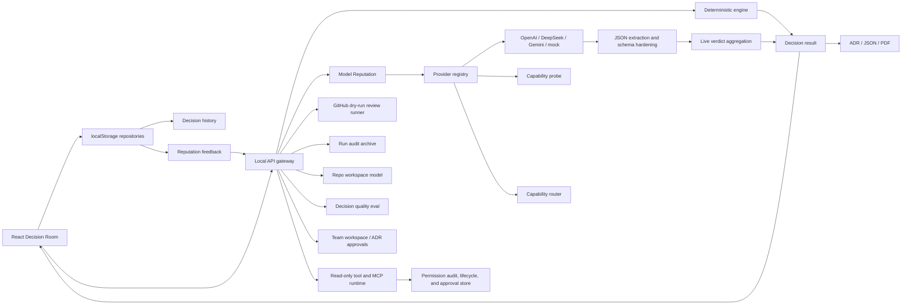

# QuorumMind Architecture

QuorumMind is structured as a local-first multi-agent decision system. The browser owns the product workspace, the local API server owns provider credentials and live model orchestration, and the decision engine owns deterministic scoring and exportable records.

## System Boundaries

- **React workspace** (`src/App.tsx`): Decision Room setup, provider trace inspection, scoring transparency, history restore, ADR/JSON/PDF exports, and English/Chinese UI.
- **Decision engine** (`src/lib/workflow.ts`, `src/lib/scoring.ts`, `src/lib/ahp.ts`): deterministic proposals, critiques, revisions, rankings, consensus scoring, AHP sensitivity, TOPSIS, Monte Carlo stress testing, regret analysis, and ADR generation.
- **Local API gateway** (`server/decision-api.ts`): validates user payloads, keeps API keys out of the browser, chooses demo or live provider mode, and returns a full decision trace.
- **Provider adapters and router** (`server/providers/*`): OpenAI, DeepSeek, Gemini, Anthropic, OpenRouter, Ollama, LM Studio, and unified OpenAI-compatible gateway adapters behind a common `ModelProvider` interface. Capability probes run through a bounded, opt-in endpoint for schema stability, latency, repair rate, and failure rate. The provider capability router selects model seats per task and explains capability trade-offs.
- **GitHub review runner** (`server/github/*`, `github/action.yml`): parses `/quorummind` comments, builds repo/PR evidence packages, can ingest PR files, patches, labels, comments, and review history, emits dry-run review Markdown by default, and can post a GitHub comment only when explicitly configured. Native GitHub payloads are validated, line-mapped to patch hunks, deduplicated, and annotated with minimum permission notes.
- **Tool and permission boundary** (`server/tools/*`, `server/harness/*`): lists sanitized MCP/custom tool manifests, executes read-only custom tool paths, starts stdio MCP sessions only from server-side code, filters MCP calls to read-only tool names, stores permission approval records, and exposes approval replies/revocation/lifecycle summaries for human-gated actions.
- **Run audit archive** (`server/harness/run-audit-replay.ts`): merges run status, events, artifacts, provider calls, GitHub outputs, and permission decisions into searchable replay summaries, run-to-run diffs, and exportable audit bundles with PR/ADR links. The Workbench can load bundle manifests and show run diffs beside the replay timeline.
- **Repo review evidence and workspace model** (`server/repo/*`): extracts changed-file lists, diff summaries, ADR references, risk radar signals, file trees, selected file previews, dependency/import graph hints, architecture boundaries, API surface exports, evidence IDs, change impact, hotspots, test evidence, and CI evidence for architecture review workflows.
- **Decision quality evaluation** (`server/quality/decision-quality-eval.ts`): local golden-case rubric judge, provider reputation summary, trend-entry generation, and an opt-in LLM-as-a-Judge adapter that records provider/model, agreement, skip/error state, and privacy notes.
- **Team workspace foundation** (`server/team/team-workspace.ts`, `server/team/postgres-team-workspace-repository.ts`): local team records, role-based access checks, ADR approval records/replies, and a Postgres query-client repository adapter for deployments that supply a database client. Local-first API endpoints keep the connection string hidden and do not open database connections by default.
- **Schema hardening** (`server/provider-json.ts`, `server/provider-schema.ts`): extracts JSON from model text, validates phase-specific payloads, repairs bounded fields, and classifies parse/schema failures.
- **Persistence boundary** (`src/lib/decision-repository.ts`, `server/persistence/sqlite-repository.ts`): browser localStorage history for zero-setup demos plus optional server-side SQLite snapshots when `QUORUMMIND_SQLITE_PATH` is set.
- **Reputation feedback** (`src/lib/reputation-feedback.ts`, `src/lib/model-reputation.ts`): local user ratings are validated, retained, sent to the API, and converted into bounded model-domain weight calibration.

## System Diagram

## Live Decision Flow

1. The browser posts `/api/decisions` with question, context, locale, run profile, agent seats, and local reputation feedback.
2. The API applies model reputation calibration and runs the deterministic decision engine as a stable fallback.
3. In live mode, configured providers run proposal, critique, revision, ranking, and verdict phases.
4. Critique receives anonymized proposal payloads for Blind Review.
5. Provider text is parsed, schema-normalized, and recorded with validation metadata.
6. Live aggregation uses normalized payloads first and falls back to raw parsed JSON only when needed.
7. The browser displays the final verdict, trace telemetry, scoring evidence, ADR preview, and export actions.

## Reliability Design

- Secrets stay server-side and are never returned by `/api/health`.
- Live provider failure does not break the Decision Room; deterministic output remains available.
- SQLite persistence is optional; if it is not configured, the API continues with browser-local history.
- Trace entries include `runId`, phase, provider, duration, parse status, validation status, validation issues, and failure class.
- Retry policy is explicit and bounded. The default is one attempt to avoid surprise API spend; callers can opt into capped retries with per-attempt trace records.
- Model JSON can be strict JSON, fenced JSON, or narrated text containing balanced JSON.
- Proposal authors are anonymized before cross-examination to reduce model-brand bias.
- History snapshots include result, trace, prompt bundle, and live verdict so rooms can be restored without rerunning providers.
- Reputation feedback is bounded, domain-specific, and validated before it changes model-seat weights.
- Audit bundles are derived artifacts; failures to project read models or bundles should not corrupt the original run event log.
- Team/Postgres support is repository-ready but driver-neutral: deployments can supply a Postgres query client, while local-first API responses still avoid returning connection strings or opening database connections.

## Extension Points

- Add a model by implementing `ModelProvider` and registering it in `server/providers/registry.ts`.
- Add a read-only tool by declaring it in `quorummind.config.json`, allowing it under `agents.<agentId>.tools`, and routing it through `server/tools/read-only-tools.ts` or the read-only MCP runtime.
- Add public MCP session APIs only after the server can prove which configured commands and write-capable tools are allowed. The current runtime supports server-side stdio sessions and read-only calls, but the HTTP API deliberately does not launch arbitrary MCP processes.
- Add a decision mechanism by returning it from `workflow.ts`, then exposing it in ADR, PDF, and UI.
- Add production deployment adapters around the Postgres query-client repository when multi-user team accounts require stronger concurrency and access control.
- Expand Team workspace UI with user management and approval filters when the product moves beyond local demos.
- Harden live ADR generation by extending `provider-schema.ts` with stricter phase schemas and retry policies.

## GitHub And Tool Execution Boundaries

The GitHub runner is intentionally conservative. `POST /api/github/run` and the composite action produce a review package from the comment, changed files, diff text, ADR references, and risk radar. They do not push commits or open PRs. GitHub comment write-back requires an explicit `write_comment: "true"` action input and a `GITHUB_TOKEN`.

`quorummind.config.json` is the product-facing extension surface. MCP declarations are parsed and exposed as sanitized manifests. Server-side code can start stdio MCP sessions through `server/tools/mcp-runtime.ts`, but the public API does not launch arbitrary MCP processes. Custom tool execution is limited to read-only repo evidence summarization and is blocked unless the requesting agent has that tool in its allowlist. Every human-gated permission record can be approved, always-approved, rejected, expired, or revoked through the shared approval store.
