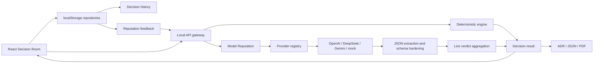

# QuorumMind Architecture

QuorumMind is structured as a local-first multi-agent decision system. The browser owns the product workspace, the local API server owns provider credentials and live model orchestration, and the decision engine owns deterministic scoring and exportable records.

## System Boundaries

- **React workspace** (`src/App.tsx`): Decision Room setup, provider trace inspection, scoring transparency, history restore, ADR/JSON/PDF exports, and English/Chinese UI.
- **Decision engine** (`src/lib/workflow.ts`, `src/lib/scoring.ts`, `src/lib/ahp.ts`): deterministic proposals, critiques, revisions, rankings, consensus scoring, AHP sensitivity, TOPSIS, Monte Carlo stress testing, regret analysis, and ADR generation.
- **Local API gateway** (`server/decision-api.ts`): validates user payloads, keeps API keys out of the browser, chooses demo or live provider mode, and returns a full decision trace.
- **Provider adapters** (`server/providers/*`): OpenAI, DeepSeek, Gemini, and unified OpenAI-compatible gateway adapters behind a common `ModelProvider` interface.
- **Schema hardening** (`server/provider-json.ts`, `server/provider-schema.ts`): extracts JSON from model text, validates phase-specific payloads, repairs bounded fields, and classifies parse/schema failures.
- **Persistence boundary** (`src/lib/decision-repository.ts`, `server/persistence/sqlite-repository.ts`): browser localStorage history for zero-setup demos plus optional server-side SQLite snapshots when `QUORUMMIND_SQLITE_PATH` is set.
- **Reputation feedback** (`src/lib/reputation-feedback.ts`, `src/lib/model-reputation.ts`): local user ratings are validated, retained, sent to the API, and converted into bounded model-domain weight calibration.

## System Diagram

## Live Decision Flow

1. The browser posts `/api/decisions` with question, context, locale, run profile, agent seats, and local reputation feedback.
2. The API applies model reputation calibration and runs the deterministic decision engine as a stable fallback.
3. In live mode, configured providers run proposal, critique, revision, ranking, and verdict phases.
4. Critique receives anonymized proposal payloads for Blind Review.
5. Provider text is parsed, schema-normalized, and recorded with validation metadata.
6. Live aggregation uses normalized payloads first and falls back to raw parsed JSON only when needed.
7. The browser displays the final verdict, trace telemetry, scoring evidence, ADR preview, and export actions.

## Reliability Design

- Secrets stay server-side and are never returned by `/api/health`.
- Live provider failure does not break the Decision Room; deterministic output remains available.
- SQLite persistence is optional; if it is not configured, the API continues with browser-local history.
- Trace entries include `runId`, phase, provider, duration, parse status, validation status, validation issues, and failure class.
- Retry policy is explicit and bounded. The default is one attempt to avoid surprise API spend; callers can opt into capped retries with per-attempt trace records.
- Model JSON can be strict JSON, fenced JSON, or narrated text containing balanced JSON.
- Proposal authors are anonymized before cross-examination to reduce model-brand bias.
- History snapshots include result, trace, prompt bundle, and live verdict so rooms can be restored without rerunning providers.
- Reputation feedback is bounded, domain-specific, and validated before it changes model-seat weights.

## Extension Points

- Add a model by implementing `ModelProvider` and registering it in `server/providers/registry.ts`.
- Add a decision mechanism by returning it from `workflow.ts`, then exposing it in ADR, PDF, and UI.
- Add server routes that let the browser list and reopen SQLite-persisted Decision Rooms.
- Replace SQLite with Postgres when multi-user team accounts require stronger concurrency and access control.
- Harden live ADR generation by extending `provider-schema.ts` with stricter phase schemas and retry policies.
