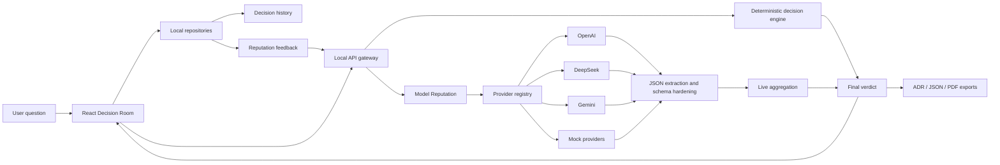

# QuorumMind Portfolio Brief

## One-Line Pitch

QuorumMind is a local-first multi-agent Decision Room that turns architecture trade-offs into adversarial review, transparent consensus scoring, and exportable ADRs.

## Why It Stands Out

Most AI demos stop at "ask several models and summarize." QuorumMind treats decision-making as an inspectable system:

- Agents propose independently, then critique anonymized proposals to reduce model-brand bias.
- The system runs cross-examination, revision, ranking, and final verdict phases.
- Consensus is computed with Borda Count, Bayesian weighted voting, minimax regret, TOPSIS, Monte Carlo stress testing, and AHP sensitivity checks.
- Provider output is schema-normalized and traceable, with validation status, retry metadata, failure classes, and raw output inspection.
- User feedback calibrates model reputation by domain, so GPT/DeepSeek/Gemini seats can earn different effective weights over time.

## Architecture Diagram

## Resume Bullets

- Built QuorumMind, a multi-agent architecture decision engine with proposal, blind review, cross-examination, revision, ranking, and ADR export phases.
- Implemented a local API gateway with OpenAI, DeepSeek, Gemini, unified-gateway, and deterministic mock providers while keeping API keys out of the browser.
- Designed a transparent consensus engine using Borda Count, Bayesian weighted voting, minimax regret, TOPSIS, Monte Carlo stress testing, AHP sensitivity analysis, Quorum Score, and Dissent Index.
- Added schema hardening for LLM output, including fenced/narrated JSON extraction, phase-specific normalization, bounded repair, retry metadata, and failure classification.
- Built a domain-aware Model Reputation loop where user feedback calibrates model weights and provider prompts across future decision runs.
- Packaged the project with CI, Docker, mock live E2E tests, SQLite persistence, architecture docs, and bilingual product UI.

## Demo Script

1. Start with the question: "Should a B2B SaaS MVP use schema-per-tenant or shared tables with tenant_id?"
2. Show the configurable GPT, DeepSeek, and Gemini agent seats.
3. Run the Decision Room in Deep mode.
4. Walk through the final recommendation, why it won, and the transparent scoring panel.
5. Open the live trace or mock live trace to show provider observability.
6. Show the Assumption Ledger, Regret Map, TOPSIS, Monte Carlo, and AHP panels.
7. Click "Helpful decision" and point out the Model Reputation calibration in the Agent lineup.
8. Export ADR Markdown and JSON trace.
9. Mention Docker and `npm run mock:e2e` for keyless reproducible demos.

## Interview Talking Points

- **Reliability:** LLM output is never trusted raw; it is parsed, normalized, validated, and traced.
- **Cost control:** Live mode defaults to bounded attempts, and mock providers exercise the same path without API spend.
- **Product thinking:** The Decision Room makes complex AI reasoning visible instead of hiding it behind one answer.
- **Extensibility:** Provider adapters, decision mechanisms, persistence, and exports are separated by clear boundaries.
- **Learning loop:** Feedback calibrates model-domain reputation through bounded score changes rather than opaque fine-tuning.

## Next Upgrade Path

- Add server routes for browsing and reopening SQLite-persisted Decision Rooms.
- Add a GitHub PR architecture-review mode.
- Add TrueSkill-style model reputation once there are enough historical labeled outcomes.
- Add team accounts and shared Decision Rooms after server-side persistence exists.
