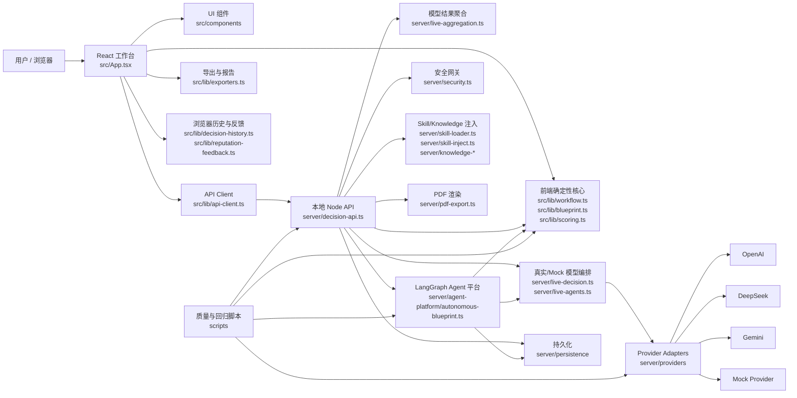
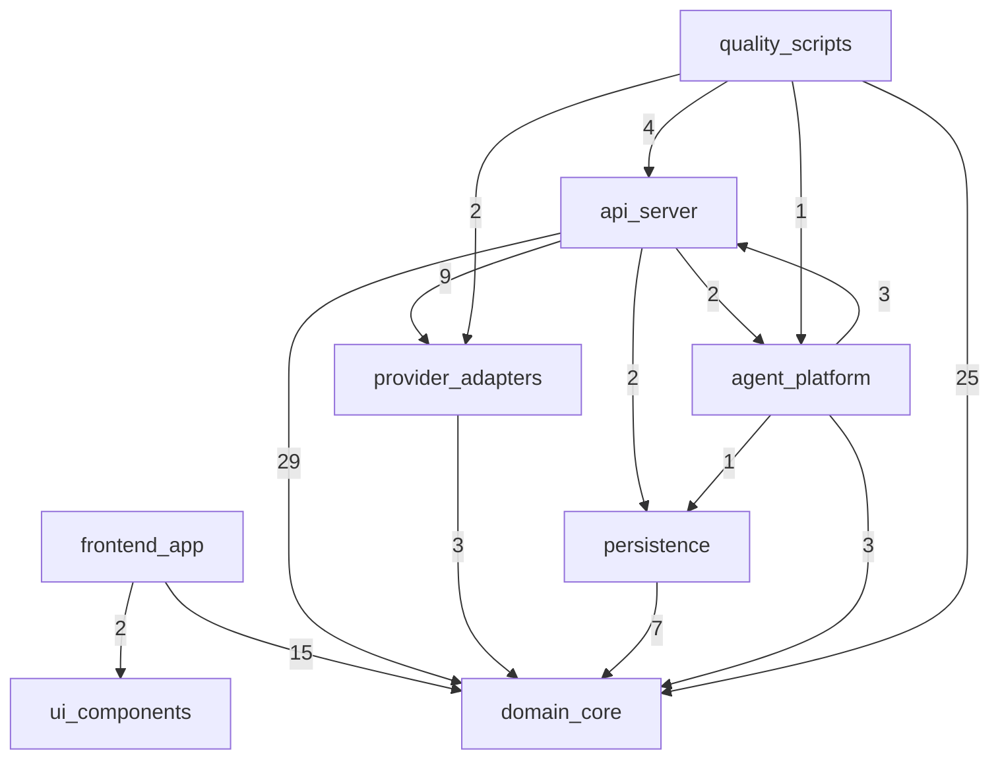
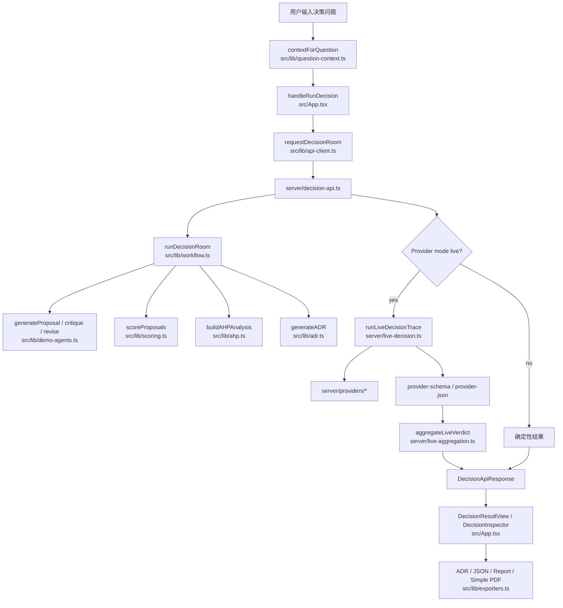
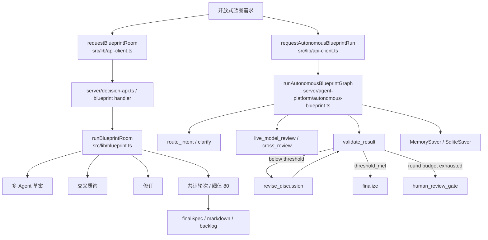
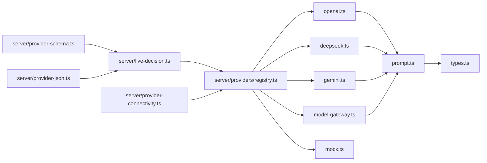
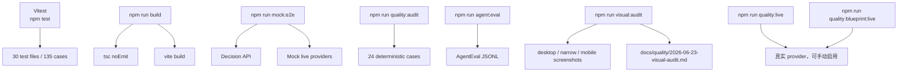

# QuorumMind Code Graph

日期：2026-06-24

说明：当前运行环境没有可调用的 `code-graph` 技能；本文件由本地代码扫描生成，覆盖 `src/`、`server/`、`scripts/` 下的 TypeScript / TSX / MJS 文件。

## 扫描概览

| 指标 | 数量 |
| --- | ---: |
| 扫描文件 | 93 |
| 本地 import 边 | 246 |
| 外部依赖入口 | React、Vite、LangGraph、LangChain Core、GSAP、Zod、Playwright、Vitest、Node 内置模块 |

## 顶层架构图

## 模块分组

| 分组 | 文件数 | 行数 | 角色 |
| --- | ---: | ---: | --- |
| `frontend_app` | 5 | 5362 | React 应用壳、i18n、格式化辅助 |
| `ui_components` | 2 | 188 | 面板标题、Tooltip、指标卡 |
| `domain_core` | 30 | 11761 | 决策室、蓝图室、评分、导出、历史、模型声誉、领域类型 |
| `api_server` | 25 | 5737 | API 路由、安全、live trace、聚合、PDF、skill/knowledge 注入 |
| `provider_adapters` | 15 | 1437 | OpenAI / DeepSeek / Gemini / Mock provider 适配 |
| `agent_platform` | 2 | 1966 | LangGraph autonomous Blueprint 编排 |
| `persistence` | 3 | 710 | SQLite repository / saver |
| `quality_scripts` | 9 | 4011 | mock e2e、视觉审计、系统质量审计、live audit、AgentEval |
| `other` | 2 | 382 | 入口/类型环境 |

## 分组依赖图

## 决策室主链路

## 方案蓝图与 Agent 平台链路

## Provider 与模型调用图

## 质量与评估图

## import 依赖中心

| 文件 | 被引用次数 | 说明 |
| --- | ---: | --- |
| `src/lib/domain.ts` | 45 | 全项目领域类型中心 |
| `src/lib/manual-provider.ts` | 18 | 手工 provider 配置与 prompt bundle |
| `server/providers/types.ts` | 13 | provider adapter 类型契约 |
| `src/lib/blueprint.ts` | 12 | 方案蓝图核心 |
| `src/lib/model-reputation.ts` | 12 | 模型声誉与权重修正 |
| `src/lib/workflow.ts` | 12 | 决策室确定性核心 |
| `src/lib/question-context.ts` | 9 | 问题上下文推断 |
| `src/lib/api-client.ts` | 8 | 前端 API 边界 |
| `server/live-decision.ts` | 7 | live provider trace 编排 |
| `server/decision-api.ts` | 6 | Node API 总入口 |

## 代码体量热点

| 文件 | 行数 | 风险/含义 |
| --- | ---: | --- |
| `src/App.tsx` | 5191 | 前端主应用过大，是后续可维护性主要风险 |
| `src/lib/blueprint.ts` | 3456 | 蓝图规则、合成、导出前置结构集中 |
| `server/agent-platform/autonomous-blueprint.ts` | 1791 | LangGraph 编排复杂度集中 |
| `src/lib/exporters.ts` | 1478 | 多种导出格式集中 |
| `src/lib/demo-agents.ts` | 1004 | 确定性 agent 规则集中 |
| `server/decision-api.ts` | 757 | API handler 聚合了较多职责 |

## 关键边界

- 浏览器不能直接拿 API key，真实模型调用都在 `server/` 侧。
- `src/lib/*` 是可在前端和服务端共享的领域核心；这里应避免引入 Node-only API。
- `server/providers/*` 是模型供应商适配边界；新增模型应优先落在这里，而不是散落到业务逻辑。
- `server/agent-platform/autonomous-blueprint.ts` 是 LangGraph 实验/平台边界；不要把一次性 UI 状态写进 graph。
- `scripts/*` 是质量和回归入口，不应该依赖浏览器本地状态或真实 API，除非脚本名明确是 live audit。

## 推荐的后续拆分顺序

1. `src/App.tsx`
   - 拆出 `DecisionWorkbench.tsx`
   - 拆出 `BlueprintWorkbench.tsx`
   - 拆出 `SettingsPanel.tsx`
   - 拆出 `HistoryPanel.tsx`
   - 拆出 `OnboardingPanel.tsx`

2. `src/lib/blueprint.ts`
   - 拆成 `blueprint-patterns.ts`
   - `blueprint-consensus.ts`
   - `blueprint-synthesis.ts`
   - `blueprint-export-model.ts`

3. `server/decision-api.ts`
   - 拆出 `decision-routes.ts`
   - `blueprint-routes.ts`
   - `agent-routes.ts`
   - `pdf-routes.ts`
   - `provider-test-routes.ts`

4. `server/agent-platform/autonomous-blueprint.ts`
   - 拆出 graph state/types
   - 拆出 nodes
   - 拆出 routing policy
   - 拆出 human review package

## 当前结构判断

项目已经不是简单 demo，而是一个较完整的本地 AI 决策工作台。当前最大工程风险不是“功能不够”，而是功能增长后几个大文件继续膨胀。下一步最有价值的 code-graph 行动，是按上面的边界拆分 `App.tsx`、`blueprint.ts`、`decision-api.ts` 和 `autonomous-blueprint.ts`，让图上的节点变小、依赖方向更清楚。
