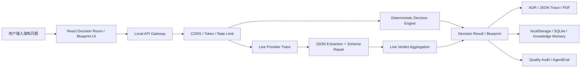

# QuorumMind 项目完整解析与 Agent Harness 面试手册

> 面向 AI Agent / 大模型应用开发岗位。本文只总结当前代码仓库中能够找到证据的内容；未实现但值得参考的内容会单独放在“后续改进路线”部分。

---

## 1. 项目一句话定位

QuorumMind 是一个面向架构评审、技术选型和复杂方案比较的多 Agent 决策平台。它把用户提出的模糊问题，例如“多租户 SaaS 应该使用独立 schema 还是共享表”，拆成多个专家 Agent 的独立提案、匿名互评、交叉质询、修订、共识评分和最终 ADR 导出。

它不是简单的 Prompt Demo。当前仓库已经包含：

- React 决策工作台和 Blueprint 工作台，入口在 `src/App.tsx`。
- 本地 API 网关，入口在 `server/index.ts` 和 `server/decision-api.ts`。
- 确定性决策引擎，核心在 `src/lib/workflow.ts`、`src/lib/scoring.ts`、`src/lib/ahp.ts`。
- OpenAI / DeepSeek / Gemini / Mock Provider 适配层，核心在 `server/providers/`。
- 结构化输出解析与 Schema 修复，核心在 `server/provider-json.ts` 和 `server/provider-schema.ts`。
- LangGraph Blueprint Agent 流程，核心在 `server/agent-platform/autonomous-blueprint.ts`。
- SQLite 持久化、模型声誉反馈、质量评测和视觉审计脚本。

更准确地说，QuorumMind 的核心价值是：**把大模型从“直接回答问题”升级为“可追踪、可评审、可回退、可导出的多 Agent 决策流程”。**

---

## 2. 真实业务场景

### 场景 A：B2B SaaS 多租户数据库方案选择

用户可能输入：

```text
Should a B2B SaaS MVP use schema-per-tenant or shared tables with tenant_id in PostgreSQL?
```

系统做的事情不是让一个模型直接回答，而是：

1. 构造一个决策上下文，包括问题、约束、决策模式和语言。
2. 让多个专家 Agent 从不同角度提出方案：
   - 首席架构师关注整体演进。
   - SRE 审查员关注可观测性、可靠性和运维复杂度。
   - 安全审查员关注租户隔离和越权风险。
   - 成本工程师关注开发成本和长期维护成本。
   - 实用构建者关注 MVP 交付速度。
3. 对提案进行盲审，把提案作者隐藏成 Proposal A / B / C，降低角色或模型品牌偏见。
4. 根据批评意见修订方案。
5. 使用 Borda Count、加权效用、共识分、分歧指数、遗憾值、TOPSIS、Monte Carlo 等机制计算最终建议。
6. 输出可复制的 ADR、JSON Trace 或 PDF 报告。

相关文件：

- `src/lib/workflow.ts`：确定性 Decision Room 主流程。
- `src/lib/demo-agents.ts`：确定性专家 Agent。
- `src/lib/scoring.ts`：评分和排序机制。
- `src/lib/adr.ts`：ADR 生成。
- `server/blind-review.ts`：盲审匿名化。

### 场景 B：微服务 vs 模块化单体架构评审

用户可能输入：

```text
我们的团队只有 5 个人，业务还在快速试错阶段，是否应该拆成微服务？
```

QuorumMind 适合这类问题，因为它不是只给“微服务好/不好”的结论，而是会把问题拆成多个评价维度：

- 团队规模是否能承担服务治理成本。
- 当前业务变化频率是否适合强边界拆分。
- 是否已有明确的扩展瓶颈。
- 部署、监控、链路追踪、故障定位成本是否可控。
- 未来从模块化单体迁移到微服务的路径是否保留。

这类结果在面试中很好解释：**QuorumMind 用 Agent 分歧和共识机制帮助团队看见取舍，而不是把大模型当成单一裁判。**

### 场景 C：AI Agent 框架选型

用户可能输入：

```text
我要做一个企业内部知识库 Agent，应该用 LangGraph、AutoGen 还是自己写状态机？
```

QuorumMind 会从以下角度评估：

- 是否需要长流程状态持久化。
- 是否需要 Human-in-the-loop。
- 是否需要多 Agent 角色协作。
- 是否需要工具调用审计。
- 团队是否能维护框架复杂度。

这个场景和你的求职方向高度贴合，因为它能体现你不是只会“调用 API”，而是理解 Agent 系统里的状态、工具、记忆、评测、失败恢复和人工复审。

---

## 3. 端到端链路

QuorumMind 的主链路可以理解为：



### 3.1 前端入口

前端主体在 `src/App.tsx`。用户在浏览器里选择 Decision Room 或 Blueprint 模式，填写问题、上下文、模型席位、执行模式等信息。前端通过 `src/lib/api-client.ts` 调用后端 API。

### 3.2 API 网关

`server/decision-api.ts` 是后端请求入口。它负责：

- 校验请求 JSON。
- 做 CORS / Token / RateLimit 等安全检查。
- 判断当前是 demo 模式还是 live provider 模式。
- 调用确定性决策引擎。
- 如果配置了 live provider，则调用真实或 mock provider。
- 汇总 provider trace、live verdict、prompt bundle 和 result。
- 可选写入 SQLite。

关键端点包括：

| 端点 | 作用 |
|---|---|
| `/api/health` | 返回服务状态、provider 配置状态，不泄露密钥 |
| `/api/security` | 返回安全配置状态 |
| `/api/providers/test` | 测试 provider 连通性 |
| `/api/decisions` | 执行 Decision Room |
| `/api/blueprints` | 执行 Blueprint |
| `/api/agent-runs/blueprint` | 执行 LangGraph Agent Blueprint |
| `/api/exports/pdf` | 导出 PDF |
| `/api/rooms` | 查询持久化的决策房间 |

### 3.3 确定性引擎和 Live Provider 双轨

QuorumMind 有一个很重要的设计：**即使没有任何 API Key，也能跑完整 Demo**。

- Demo 模式：使用本地确定性 Agent，不调用外部模型，便于演示、CI 和低成本回归。
- Live 模式：调用 OpenAI / DeepSeek / Gemini / Mock Provider，并记录 provider trace。
- Mock live 模式：不花真实 API 钱，但走和 live 类似的 trace、schema、aggregation 管线。

这比“只有真实模型调用”的项目更稳，因为测试和演示不依赖外部服务。

---

## 4. 多 Agent 决策机制

### 4.1 Agent 不是简单人设，而是决策席位

QuorumMind 的 Agent 角色来自架构评审场景，不是随便起几个名字。典型席位包括：

| Agent 角色 | 关注点 |
|---|---|
| Principal Architect | 架构整体性、长期演进、边界设计 |
| SRE Reviewer | 可用性、故障恢复、运维复杂度 |
| Security Reviewer | 安全边界、权限、租户隔离、攻击面 |
| Cost Engineer | 成本、资源消耗、团队投入 |
| Pragmatic Builder | MVP 交付速度、实现复杂度、落地性 |

在确定性模式下，这些角色由 `src/lib/demo-agents.ts` 实现。在 Live 模式下，Provider 会按照不同 agent seat 的角色、权重和 scoring focus 构造 Prompt。

### 4.2 决策流程

典型流程是：

```text
用户问题
  -> 生成多个独立提案
  -> 匿名盲审
  -> 交叉质询
  -> 提案修订
  -> 排名与评分
  -> 共识/分歧分析
  -> 最终裁决
  -> ADR / JSON Trace / PDF
```

在 `server/live-agents.ts` 中，Live Agent 的生成过程包含：

- `generateLiveProposal()`：构造提案。
- `generateLiveCritique()`：对匿名提案做评审。
- `reviseLiveProposal()`：根据批评进行修订。

每一步都会尝试解析模型输出，并通过 `normalizeProviderPayload()` 做 Schema 归一化。如果解析失败，系统不会直接崩掉，而是生成降级结果或走确定性回退。

### 4.3 盲审为什么重要

盲审的作用是减少偏见。比如如果 Critic 看到某个方案来自“Principal Architect”，可能默认给它更高权威；如果看到来自“Cost Engineer”，可能低估其架构价值。

QuorumMind 使用 Proposal A / B / C 的匿名形式，让评审重点落在方案内容本身。

这在面试里可以这样说：

```text
我没有让多个 Agent 直接互相喊话，而是在交叉评审阶段隐藏提案来源，尽量让 Critic 按方案质量而不是角色身份做判断。这是为了降低多 Agent Debate 中常见的权威偏见和模型品牌偏见。
```

---

## 5. Blueprint / LangGraph Agent 平台

QuorumMind 不只有 Decision Room，还包含一个更像 Agent 工作流的 Blueprint 平台，核心在 `server/agent-platform/autonomous-blueprint.ts`。

### 5.1 为什么使用 LangGraph

LangGraph 适合这种场景，因为 Blueprint 不是一次问答，而是一个有状态的流程：

```text
理解需求
  -> 规划任务
  -> 执行方案草稿
  -> Critic 审查
  -> 交叉审查
  -> 验证共识
  -> 修订
  -> 人工复审或最终化
```

普通链式调用很难清楚表达“什么时候继续讨论、什么时候停止、什么时候进入人工复审”。LangGraph 的价值在于：

- 用图节点表达流程阶段。
- 用状态保存中间结果。
- 用条件路由表达是否继续。
- 用 checkpoint thread 支持恢复。
- 用 Human-in-the-loop 在关键节点暂停。

### 5.2 Checkpoint Thread 是什么

可以把 checkpoint thread 理解为一次 Agent 运行的“存档编号”。

如果系统在多轮讨论后没有达成足够共识，就进入 `human_review_gate`。这时 QuorumMind 会保留当前状态，包括：

- 任务树。
- 当前方案。
- Critic 反馈。
- 共识分。
- 分歧点。
- 下一步建议。

用户补充人工复审意见后，可以用同一个 thread id 恢复，让后续推理继续利用之前的状态，而不是从头开始。

### 5.3 Human-in-the-loop 的作用

Human-in-the-loop 不是装饰功能，它解决的是 Agent 无法可靠自行判断的边界情况：

- 共识分不足。
- 讨论轮次耗尽。
- 关键风险仍未解决。
- 需要人类给额外约束。

面试可以这样讲：

```text
我把 Human-in-the-loop 放在共识失败或预算耗尽之后，而不是每一步都让人确认。这样既保留 Agent 自主性，又避免它在不确定情况下强行给出结论。
```

---

## 6. Harness 工程能力

这里的 Harness 指 Agent 外围的工程保护壳：它不直接产生业务答案，但决定 Agent 是否可靠、可控、可评测、可恢复。

### 6.1 API 网关和安全边界

实现文件：

- `server/decision-api.ts`
- `server/security.ts`
- `server/index.ts`

为什么需要：

大模型应用不能让浏览器直接拿 API Key 调模型，否则密钥会暴露。也不能让任何来源无限请求，否则容易被刷接口或产生意外成本。

QuorumMind 的做法：

- 浏览器只请求本地 API。
- API Key 保留在服务端环境变量里。
- `/api/health` 只返回 provider 是否配置，不返回密钥值。
- 通过 CORS、Bearer Token、RateLimit、安全头做基础防护。

面试说法：

```text
我把模型调用封装在本地 API 网关里，浏览器只看到 provider 状态和 trace，不接触真实密钥。这样既方便前端演示，也避免把 OpenAI / DeepSeek / Gemini 的 key 暴露给客户端。
```

### 6.2 Provider 适配层

实现文件：

- `server/providers/types.ts`
- `server/providers/registry.ts`
- `server/providers/openai.ts`
- `server/providers/deepseek.ts`
- `server/providers/gemini.ts`
- `server/providers/model-gateway.ts`
- `server/providers/mock.ts`

为什么需要：

不同模型厂商 API 格式不同，但业务流程不应该关心具体厂商。否则每加一个模型，都要改 Decision Room 主逻辑。

QuorumMind 的做法：

- 定义统一 `ModelProvider` 接口。
- OpenAI、DeepSeek、Gemini、Model Gateway、Mock Provider 都适配到同一接口。
- Provider Registry 统一读取环境变量和模型配置。
- Mock Provider 用于 CI 和演示，避免真实 API 成本。

面试说法：

```text
我做了 Provider Adapter，把不同厂商封装成统一的 generateDecisionText 接口。决策流程只关心 proposal、critique、revision、ranking、verdict 这些阶段，不关心底层是 OpenAI 还是 DeepSeek。
```

### 6.3 JSON 提取与 Schema 修复

实现文件：

- `server/provider-json.ts`
- `server/provider-schema.ts`

为什么需要：

模型经常不会老老实实返回 JSON。有时会返回：

```text
下面是我的答案：
```json
{ ... }
```
```

或者前后夹杂解释文字。直接 `JSON.parse()` 很容易失败。

QuorumMind 的做法：

- `provider-json.ts` 支持严格 JSON、Markdown fenced JSON、叙述文本中的平衡 JSON。
- `provider-schema.ts` 按阶段做归一化：
  - proposal / revision 需要 recommendation、criteriaScores、confidence 等。
  - ranking 需要 rankedProposalIds。
  - verdict 需要 selectedProposalId 和 finalRecommendation。
- 对缺失的非关键字段使用有界默认值。
- 对越界分数做 0-100 或 0-1 限幅。
- 对关键字段缺失的结果判定为 invalid。

面试说法：

```text
我没有直接相信模型 JSON，而是做了提取、归一化和有界修复。比如模型把 criteria_scores 写成蛇形命名，或者 confidence 超过 1，系统会修复；但如果没有 recommendation 这种关键字段，就会拒绝这次输出，避免坏数据进入最终决策。
```

### 6.4 Trace、Retry 和 Fallback

实现文件：

- `server/live-decision.ts`
- `server/live-agents.ts`
- `server/live-aggregation.ts`
- `server/decision-api.ts`

为什么需要：

真实模型调用会失败：超时、限流、返回非 JSON、安全拒绝、模型答非所问。如果没有 trace 和 fallback，用户只能看到“生成失败”，不知道哪一步坏了。

QuorumMind 的做法：

- 每次 provider 调用记录 provider、phase、duration、parse 状态、validation 状态和失败信息。
- Live aggregation 优先使用 schema-normalized payload。
- Live 不可用时，确定性引擎仍然能给出结果。
- 默认 retry 是有界的，避免意外 API 消耗。

面试说法：

```text
我把 live provider 的每一步都变成可观察 trace，而不是只拿最终文本。这样可以知道失败是发生在 proposal、critique 还是 verdict 阶段，是 JSON 解析失败还是 Schema 无法修复。
```

### 6.5 Memory 和知识注入

实现文件：

- `server/knowledge-index.ts`
- `server/knowledge-inject.ts`
- `server/knowledge-store.ts`
- `server/context-compressor.ts`
- `server/persistence/sqlite-saver.ts`

为什么需要：

复杂决策不是一次孤立问答。系统需要记住历史决策、长期原则、模型声誉反馈，以及 LangGraph 中间状态。

QuorumMind 的做法：

- 文件系统记忆：`~/.quorummind/KNOWLEDGE.md` 和 `decisions/*.md`。
- 轻量关键词索引：用于把相关历史知识注入新问题。
- SQLite Saver：为 LangGraph checkpoint 提供持久化能力。
- Context Compressor：在上下文压力增大时做摘要压缩。

面试说法：

```text
我把记忆分成当前上下文、工作状态和长期记忆三层。模型本身不可靠地记住历史，所以我把历史决策摘要和知识原则落盘，再在新问题里检索相关内容注入 Prompt。
```

### 6.6 Skill 注入

实现文件：

- `server/skill-loader.ts`
- `server/skill-inject.ts`
- `skills/quorummind-*/SKILL.md`

为什么需要：

不同问题需要不同审查框架。安全问题需要安全审查，成本问题需要成本模型，Agent 评估问题需要 AgentEval 方法。把所有说明都塞进 Prompt 会浪费上下文，也会干扰模型。

QuorumMind 的做法：

- 先根据领域、关键词、Agent 角色匹配候选 skill。
- 再让模型返回 `skills_used`。
- 系统根据选择注入对应 skill 摘要。
- 控制候选数量和注入长度。

面试说法：

```text
我参考了 Codex / Claude Code 的 Skill 思路，不是把所有指南都塞给模型，而是按问题和 Agent 角色动态注入少量相关技能说明，控制上下文成本。
```

### 6.7 持久化

实现文件：

- `src/lib/decision-repository.ts`
- `src/lib/decision-history.ts`
- `server/persistence/sqlite-repository.ts`
- `server/persistence/sqlite-schema.sql`

为什么需要：

用户需要恢复历史决策，也需要把 provider trace、prompt bundle、ADR 等证据留存下来，否则系统很难审计。

QuorumMind 的做法：

- 前端默认用 localStorage 保存历史。
- 服务端可选 SQLite，保存 decision room summary、decision trace、reputation feedback。
- SQLite 是可选的；不配置时系统仍可用。

面试说法：

```text
我把持久化设计成可选边界。Demo 场景可以只用 localStorage，部署或审计场景可以打开 SQLite，把决策结果、trace、prompt bundle 和 ADR 保存下来。
```

### 6.8 质量评测和 AgentEval

实现文件：

- `scripts/system-quality-audit.ts`
- `scripts/agent-performance-eval.ts`
- `scripts/live-model-quality-audit.ts`
- `scripts/live-blueprint-quality-audit.ts`
- `scripts/provider-deep-connectivity-audit.ts`
- `scripts/mock-e2e.ts`
- `scripts/visual-audit.ts`
- `eval/agent-eval-cases.jsonl`

为什么需要：

Agent 项目最怕只看几个 demo case。真实系统需要回归测试和质量趋势，才能知道改动是否让输出变差。

QuorumMind 的做法：

- `npm test`：单元测试。
- `npm run mock:e2e`：无 key 的 live-like 端到端测试。
- `npm run quality:audit`：确定性系统质量审计。
- `npm run agent:eval`：离线 AgentEval。
- `npm run quality:live`：真实或 mock provider 质量审计。
- `npm run visual:audit`：Playwright 视觉审计。

面试说法：

```text
我把 Agent 输出质量做成可重复评测，而不是凭主观感觉判断。比如 mock provider 可以在 CI 中验证 trace、JSON parse 和 schema repair 链路，真实 provider audit 则用于低频检查模型质量变化。
```

### 6.9 垃圾回收和长期状态卫生

实现文件：

- `server/garbage-collector.ts`

为什么需要：

Agent 系统会不断产生历史决策、checkpoint、日志、声誉反馈。如果不清理，系统会越来越慢、越来越难审计。

QuorumMind 的做法：

- 清理过期 decision summary。
- 清理过期 LangGraph checkpoints。
- 限制 pressure log 保留量。
- 对老的 reputation feedback 做衰减或清理。

面试说法：

```text
我把长期运行的状态熵增也考虑进 Harness。Agent 不只是能跑一次，还要考虑历史决策、checkpoint 和反馈记录如何过期、归档和清理。
```

---

## 7. 与 OpenCode Harness 的差距

我参考的 OpenCode 是 `opencode` 目录下的 `anomalyco/opencode`。它是一个通用 Coding Agent Runtime，而 QuorumMind 是垂直业务 Agent 应用，所以不能照搬，但它的 Harness 工程很值得借鉴。

### 7.1 两者定位差异

| 维度 | QuorumMind | OpenCode |
|---|---|---|
| 核心目标 | 架构决策、多 Agent 共识、ADR 导出 | 通用代码 Agent 执行环境 |
| Harness 重点 | Provider Trace、Schema 修复、评测、决策持久化 | Session Runtime、工具权限、事件流、SDK、插件 |
| Agent 类型 | 专家评审席位 | 可执行 Agent，包括 build / plan / subagent |
| 工具风险 | 主要是 provider 调用和报告导出 | 读文件、改文件、跑命令、调用工具、跨会话恢复 |
| 适合简历叙事 | 业务闭环强 | 平台工程深 |

### 7.2 OpenCode 里值得参考的点

#### A. Tool Permission Model

OpenCode 有明确的工具权限规则：

```text
action + resource + ruleset -> allow / ask / deny
```

它能针对每次工具调用判断是否允许、拒绝或请求用户确认。QuorumMind 已经新增了适合自身业务边界的 `server/harness/tool-governance.ts`，不是照搬 Bash / 文件编辑权限，而是围绕 read-only、本地 checkpoint 写入、真实模型调用、外部 API、生产操作和付费操作做分类。

适合 QuorumMind 的转译方式：

```text
read_only -> auto
local_checkpoint_write -> auto
live_model_call -> requires_human / auto if user preapproved
external_api_call -> requires_human
paid_operation -> requires_human
production_operation -> blocked
```

这样可以避免 Agent 或前端误触发高成本真实模型调用，也避免“设计蓝图”类 Agent 被误理解成可以自动部署、删除数据或发外部通知。

#### B. Bounded Tool Output Store

OpenCode 会限制工具输出最大行数和字节数，超长内容保存到文件，只把预览放入模型上下文。

QuorumMind 已新增 `server/harness/bounded-output-store.ts`，用于处理：

- live audit 长报告。
- provider raw output。
- AgentEval 详细结果。
- Blueprint trace。

当前机制：

```text
trace preview: 保留前后关键内容
sha256: 记录完整内容 hash，便于审计对齐
originalChars / omittedChars: 记录被截断规模
inline: 短输出保留全文，长输出只把 preview 放进 trace
```

这样可以避免把超长 provider raw output、Blueprint Markdown 或 trace 塞进页面、Prompt 和 context 压缩估算里，同时保留可审计的摘要证据。

#### C. Durable Event Stream

OpenCode 把 session、permission、tool、message 等变化做成 event。QuorumMind 已在 live provider 链路新增 `server/harness/run-event-trace.ts`，支持 run-level event stream；但它目前仍聚焦 provider/tool 调用链，还不是 OpenCode 那种覆盖整个会话生命周期的通用事件总线。

QuorumMind 可参考设计：

```text
run_start
provider_attempt_start
provider_attempt_success
provider_attempt_retry
provider_attempt_failure
run_complete
```

这让 QuorumMind 不再只是返回一个大 JSON，而是可以同时返回 `providerTrace` 和 `providerRun.events`，便于 UI、日志、评测和失败排查消费同一套运行证据。

#### D. Agent 权限绑定

OpenCode 的 Agent Schema 中有 mode、steps、permissions。QuorumMind 的 Agent 当前更偏业务角色和权重。

QuorumMind 可改进为：

```text
security_reviewer:
  can_score: security, reliability
  can_request_skill: security
  cannot_finalize_verdict: true

cost_engineer:
  can_score: costEfficiency, timeToMarket
  can_request_skill: cost-modeling
```

这样 Agent 的职责边界会更具体，不只是“角色名”。

#### E. Session Runtime

OpenCode 对 session history、context epoch、mid-conversation system message、tool settlement 做了非常细的定义。

QuorumMind 不需要完全照搬，但可以借鉴：

- run_id 和 thread_id 统一。
- 每次上下文变化都有 snapshot。
- human review resume 时记录补充信息。
- provider mode / model seat 变化写入 trace。

### 7.3 不建议照搬的点

不建议把 OpenCode 的这些能力直接硬塞进 QuorumMind：

- Bash 工具权限。
- 文件编辑权限。
- Coding Agent 的 patch / revert / worktree 机制。
- 多端 CLI / TUI / Desktop 运行时。
- 通用 SDK 和插件市场。

原因很简单：QuorumMind 是决策系统，不是代码执行 Agent。照搬会让项目变复杂，但不提升核心业务价值。

---

## 8. 技术栈逐项解释

| 技术 | 在项目中的作用 | 为什么使用 |
|---|---|---|
| TypeScript | 前后端统一类型，定义 Agent、Proposal、Verdict、Trace 等结构 | Agent 项目数据结构复杂，强类型能降低字段错配 |
| React | 决策工作台、Blueprint 面板、Trace 展示、Prompt Inspector | 需要交互式 UI 展示多阶段结果 |
| Vite | 前端开发服务器和构建工具 | 启动快，适合本地演示 |
| Node 原生 HTTP | 本地 API 网关 | 项目体量不大，避免引入 Express 额外复杂度 |
| Zod | 请求校验、配置校验、运行时数据保护 | 模型输出和用户输入都不可信，需要运行时 Schema |
| LangGraph | Blueprint Agent 状态图、checkpoint、human review gate | 多阶段 Agent 流程需要显式状态和路由 |
| LangChain | LangGraph 相关生态与 runnable config | 和 LangGraph 工作流配套 |
| SQLite | 可选服务端持久化、LangGraph checkpoint | 本地优先，部署简单，不需要额外数据库服务 |
| Vitest | 单元测试和服务端测试 | TypeScript 项目轻量测试工具 |
| Playwright | 视觉审计和 UI 回归 | Agent 产品不只看接口，也要保证演示 UI 可用 |
| Prompt Engineering | 分阶段构造 proposal / critique / revision / ranking / verdict Prompt | 控制模型输出格式和角色行为 |
| AgentEval | 离线评估 Agent 输出质量和执行轨迹 | 避免只靠主观 demo 判断 Agent 好坏 |

---

## 9. 文件索引

| 能力 | 主要文件 | 作用 |
|---|---|---|
| 前端主界面 | `src/App.tsx` | Decision Room / Blueprint UI |
| API 客户端 | `src/lib/api-client.ts` | 前端调用后端接口 |
| 决策主流程 | `src/lib/workflow.ts` | 提案、评审、修订、排名、裁决 |
| 蓝图引擎 | `src/lib/blueprint.ts` | Blueprint 输出和实施计划 |
| 确定性 Agent | `src/lib/demo-agents.ts` | 无 API Key 的专家 Agent |
| 评分系统 | `src/lib/scoring.ts` | Borda、共识分、分歧指数、TOPSIS 等 |
| AHP 分析 | `src/lib/ahp.ts` | 敏感性分析 |
| ADR 生成 | `src/lib/adr.ts` | 架构决策记录 |
| 导出 | `src/lib/exporters.ts` | ADR、JSON Trace、PDF 报告 |
| 模型声誉 | `src/lib/model-reputation.ts` | 根据反馈调整模型席位权重 |
| 用户反馈 | `src/lib/reputation-feedback.ts` | 保存 helpful / neutral / unhelpful |
| API 网关 | `server/decision-api.ts` | 核心路由、demo/live 切换、持久化 |
| 服务入口 | `server/index.ts` | 本地 HTTP 服务 |
| 安全 | `server/security.ts` | CORS、Token、RateLimit、安全头 |
| Live 决策 | `server/live-decision.ts` | Provider 多阶段调用 |
| Live Agent | `server/live-agents.ts` | proposal / critique / revision |
| Live 聚合 | `server/live-aggregation.ts` | 从 provider trace 得出 live verdict |
| JSON 提取 | `server/provider-json.ts` | 提取模型返回中的 JSON |
| Schema 修复 | `server/provider-schema.ts` | 修复或拒绝模型结构化输出 |
| Provider 注册 | `server/providers/registry.ts` | OpenAI / DeepSeek / Gemini / Mock |
| Prompt 模板 | `server/providers/prompt.ts` | 分阶段 Prompt |
| LangGraph Agent | `server/agent-platform/autonomous-blueprint.ts` | Planner / Executor / Critic / Memory / Supervisor |
| SQLite 决策仓库 | `server/persistence/sqlite-repository.ts` | 保存决策房间和 trace |
| LangGraph Saver | `server/persistence/sqlite-saver.ts` | 保存 checkpoint |
| Skill 加载 | `server/skill-loader.ts` | 匹配可用技能 |
| Skill 注入 | `server/skill-inject.ts` | 构造 skill candidate / injection |
| 知识注入 | `server/knowledge-inject.ts` | 历史知识注入 |
| 垃圾回收 | `server/garbage-collector.ts` | 清理过期状态 |
| AgentEval | `scripts/agent-performance-eval.ts` | 离线 Agent 质量评估 |
| Live 质量审计 | `scripts/live-model-quality-audit.ts` | 真实/Mock 模型质量回归 |
| Provider 连通性 | `scripts/provider-deep-connectivity-audit.ts` | 测试模型能否返回可用 Schema |
| 视觉审计 | `scripts/visual-audit.ts` | Playwright UI 回归 |

---

## 10. 简历亮点表述

下面这些表述比较适合 AI Agent / 大模型应用岗位：

1. 设计并实现 QuorumMind 多 Agent 决策工作流，将复杂架构问题拆解为独立提案、匿名互评、交叉质询、方案修订、共识评分和 ADR 导出，提升大模型决策过程的可解释性和可审计性。

2. 构建本地优先的 Agent Harness：通过 API 网关隔离模型密钥，支持 demo / mock live / real live 三种运行模式，并记录 provider、phase、duration、parse status、validation status 等调用证据。

3. 设计 Provider Adapter 层，统一 OpenAI、DeepSeek、Gemini 和 OpenAI-compatible gateway 调用接口，使上层决策流程无需感知具体模型厂商差异。

4. 建设结构化输出治理机制，支持严格 JSON、Markdown fenced JSON 和叙述文本 JSON 提取，并按 proposal / ranking / verdict 阶段进行 Schema 修复、字段归一化和失败分类。

5. 基于 LangGraph 实现 Blueprint Agent 工作流，引入 Planner / Executor / Critic / Memory / Supervisor 节点、checkpoint thread、共识轮次控制和 Human-in-the-loop 复审门控。

6. 建设 AgentEval 与质量审计脚本，覆盖确定性质量审计、mock E2E、live provider audit、provider connectivity 和 Playwright 视觉审计，降低 Agent 输出质量只能靠人工观察的问题。

7. 引入模型声誉反馈与持久化机制，将用户反馈、历史决策、provider trace、prompt bundle 和 ADR 输出纳入可恢复、可审计的数据闭环。

---

## 11. 面试高频问题

### Q1：为什么要用多 Agent，而不是一个模型直接回答？

可以回答：

```text
架构决策通常不是单一标准答案，而是多个目标之间的权衡。一个模型直接回答容易忽略反方观点，所以我把流程拆成多个专家席位：架构、SRE、安全、成本、落地。每个 Agent 先独立提案，再匿名互评和修订，最后用共识分、分歧指数和排序机制生成结论。这样输出不仅有结论，还有争议点和取舍依据。
```

### Q2：怎么避免模型幻觉？

可以回答：

```text
我没有假设模型输出一定正确，而是在外层做 Harness。第一，Provider 输出必须经过 JSON 提取和 Schema 归一化。第二，关键字段缺失会被判 invalid，而不是直接进入结果。第三，Live 不可用时有确定性 fallback。第四，trace 会记录每次调用的解析和校验状态。第五，质量审计脚本会持续检查输出是否相关、结构是否可用。
```

### Q3：Schema 修复和普通 JSON.parse 有什么区别？

可以回答：

```text
JSON.parse 只能判断是不是合法 JSON，但不能判断业务字段是否可用。我的 Schema 修复会按阶段处理，比如 proposal 阶段必须有 recommendation，ranking 阶段必须有 rankedProposalIds，verdict 阶段必须有 selectedProposalId 和 finalRecommendation。非关键字段可以有界修复，例如分数缺失时给中性默认值，confidence 超界时夹到 0 到 1，但关键字段缺失会拒绝。
```

### Q4：如果模型调用失败怎么办？

可以回答：

```text
系统有 demo/live 双轨。即使 provider 超时、返回非 JSON 或 schema invalid，确定性引擎仍能产出基础结果。Live trace 会记录失败发生在哪个 provider、哪个 phase、是否 parse 成功、schema 状态是什么。这样用户能看到是模型失败还是业务流程失败。
```

### Q5：为什么用 LangGraph？

可以回答：

```text
Blueprint Agent 不是一次性链式调用，而是一个可能循环、暂停、恢复的状态图。LangGraph 可以把理解需求、草稿、审查、交叉审查、验证、修订、人工复审和最终化做成显式节点，并通过 checkpoint thread 保存状态。当共识不足时，系统可以进入 human review gate，等待人类补充信息后继续。
```

### Q6：Human-in-the-loop 放在哪里？

可以回答：

```text
我没有在每一步都让人确认，而是在共识不足或讨论轮次耗尽时进入 human_review_gate。这样既保持 Agent 自动推进，又避免它在不确定状态下强行给最终结论。人工复审意见会作为恢复输入，继续影响后续 Blueprint 推理。
```

### Q7：和 OpenCode 这种成熟 Agent 项目比，QuorumMind 差距在哪里？

可以回答：

```text
OpenCode 更像平台级 Coding Agent Runtime，它有更完整的 session runtime、插件体系、工具沙箱和持久事件总线。QuorumMind 更偏业务应用级 Harness，强在多 Agent 决策、Schema 修复、provider trace 和质量评估；我参考 OpenCode 后补了适合 QuorumMind 的失败分类、运行事件流、工具治理和输出有界化首版，但没有照搬 coding agent 的文件编辑、Bash 权限和通用工具执行模型。
```

### Q8：这个项目最工程化的地方是什么？

可以回答：

```text
我认为最工程化的是把大模型调用放进可控链路里：Provider Adapter 隔离厂商差异，Schema Repair 管住输出结构，Trace 记录每次调用证据，Fallback 避免外部模型失败拖垮系统，AgentEval 和质量审计让输出质量可回归。这些都是从 demo 走向真实应用必须补的 Harness 能力。
```

---

## 12. 当前实现状态与后续改进路线

### 已实现

- Decision Room 多 Agent 决策流程。
- 确定性 Demo Agent。
- Live Provider Adapter。
- Mock Provider。
- Provider Trace。
- JSON 提取。
- Schema 修复和 invalid 分类。
- ADR / JSON Trace / PDF 导出。
- SQLite 决策快照。
- LangGraph Blueprint Agent。
- Human Review Gate。
- AgentEval 和多类质量审计脚本。
- `Failure Taxonomy`：新增统一失败分类，覆盖 timeout、rate limit、provider error、safety rejected、JSON parse、Schema validation、missing reference、QA failed、permission denied 和 unknown。
- `Run Event Trace`：新增运行级事件流，记录 run start、provider attempt start/success/retry/failure、run complete，并保留序号、阶段、provider、耗时和失败原因。
- `Bounded Output Store`：新增输出有界化机制，长输出只进入 preview/hash/截断元数据，短输出保留 inline，避免长模型输出污染 trace 和上下文压缩。
- `Tool Governance`：新增 QuorumMind 专用工具治理层，对只读、本地 checkpoint 写入、真实模型调用、外部 API、生产操作、付费操作做权限决策。

### 已有雏形，但可继续增强

- Memory / Knowledge Injection：已有文件系统记忆和知识注入，但还可以加强检索精度和证据引用。
- Skill Injection：已有 skill 匹配和注入，但可以增加更严格的权限与版本管理。
- Provider Retry：已有有界 retry 和失败分类，但后续还可以把不同失败类型绑定到更细的退避策略。
- Trace：已有 provider trace 与 run event stream，但还不是覆盖所有前端、导出、持久化和人工复审动作的全局事件总线。

### 参考 OpenCode 后建议优先改进

#### 1. Tool Governance / Permission Layer 已完成首版

```text
read_only
local_file_write
live_model_call
external_api_call
production_operation
paid_operation
```

每个动作返回：

```text
auto / requires_human / blocked
```

下一步可以继续细化到“Agent 角色权限”，例如 Security Reviewer 能主导安全审查，但不能直接 finalize verdict。

#### 2. Run Event Stream 已完成 provider 链路首版

当前 live provider 链路已经返回：

```text
providerRun.runId
providerRun.events
providerRun.summary
```

下一步可以把 Human Review、PDF 导出、SQLite 保存、AgentEval 批量任务也接到同一套事件模型。

#### 3. Bounded Output Store 已完成首版

当前已经支持：

```text
preview
inline
sha256
originalChars
omittedChars
truncated
```

下一步可以增加落盘 artifact path、保留周期和清理策略。当前版本先避免 trace 和上下文膨胀。

#### 4. Agent Role Permission

建议把 Agent 从“角色 + 权重”升级为“角色 + 权限边界”：

```text
security_reviewer 只能主导安全维度评分
cost_engineer 只能主导成本维度评分
principal_architect 可以参与最终综合裁决
```

这会让多 Agent 系统更可控。

#### 5. Failure Taxonomy 已完成首版

当前统一失败类型：

```text
timeout
rate_limit
provider_error
json_parse_error
schema_validation_error
safety_rejected
missing_reference
qa_failed
permission_denied
unknown
```

每类失败会绑定 retryability 和 severity，便于面试中解释“哪些错误能重试，哪些错误要停下来让人处理”。

---

## 13. 面试时的诚实边界

不要说：

```text
QuorumMind 已经是和 OpenCode 一样的平台级 Agent Runtime。
```

更准确的说法是：

```text
QuorumMind 是一个垂直业务场景下的多 Agent 决策系统，已经实现了 Provider Harness、Schema 修复、Trace、评测、持久化、LangGraph Blueprint，并参考 OpenCode 补齐了适合本项目边界的失败分类、运行事件流、工具治理和输出有界化首版。它仍不是 OpenCode 那种平台级 Coding Agent Runtime，后续差距主要在全局 session runtime、插件生态、通用工具执行沙箱和更完整的事件持久化。
```

这个说法更专业，也更可信。
