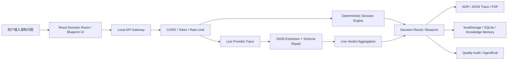

# QuorumMind Complete Analysis Document Implementation Plan

> **For agentic workers:** REQUIRED SUB-SKILL: Use superpowers:subagent-driven-development (recommended) or superpowers:executing-plans to implement this plan task-by-task. Steps use checkbox (`- [ ]`) syntax for tracking.

**Goal:** Produce a complete, interview-ready QuorumMind project analysis document that explains the real codebase, Harness engineering design, Agent workflow, technical stack, gaps versus platform-grade agents, and resume-facing highlights with concrete file references.

**Architecture:** This is a documentation-first implementation. The work should read existing code and docs, extract evidence into a structured Markdown analysis, then verify that every major claim is grounded in current repository files rather than invented project packaging.

**Tech Stack:** TypeScript, React, Vite, Node HTTP server, LangGraph, LangChain, Zod, SQLite, Vitest, Playwright, QuorumMind provider adapters, AgentEval scripts, quality audit scripts.

---

## File Structure

**Create:**
- `docs/quorummind-complete-agent-harness-analysis-2026-08-20.md`
  - Final Chinese project analysis document.
  - Audience: job interview preparation for AI Agent / LLM application roles.
  - Content style: detailed but readable, beginner-friendly, with code-path references and concrete examples.

**Modify:**
- No source code files.
- Optional only if needed after final review: `docs/quorummind-project-highlights-2026-06-25.md`
  - Do not modify unless the final analysis reveals an outdated or misleading resume summary.

**Read-only evidence files:**
- `README.md`
- `PROJECT_INDEX.md`
- `ARCHITECTURE.md`
- `HARNESS.md`
- `API_CONTRACT.md`
- `DECISION_ENGINE.md`
- `PERSISTENCE.md`
- `SECURITY_PRIVACY.md`
- `TECHNICAL_EVALUATION.md`
- `PORTFOLIO.md`
- `server/decision-api.ts`
- `server/security.ts`
- `server/live-decision.ts`
- `server/live-agents.ts`
- `server/live-aggregation.ts`
- `server/provider-json.ts`
- `server/provider-schema.ts`
- `server/providers/registry.ts`
- `server/providers/types.ts`
- `server/providers/prompt.ts`
- `server/providers/openai.ts`
- `server/providers/deepseek.ts`
- `server/providers/gemini.ts`
- `server/providers/model-gateway.ts`
- `server/providers/mock.ts`
- `server/agent-platform/autonomous-blueprint.ts`
- `server/persistence/sqlite-repository.ts`
- `server/persistence/sqlite-saver.ts`
- `server/persistence/sqlite-schema.sql`
- `server/context-compressor.ts`
- `server/knowledge-index.ts`
- `server/knowledge-inject.ts`
- `server/knowledge-store.ts`
- `server/skill-loader.ts`
- `server/skill-inject.ts`
- `server/garbage-collector.ts`
- `src/lib/workflow.ts`
- `src/lib/blueprint.ts`
- `src/lib/scoring.ts`
- `src/lib/ahp.ts`
- `src/lib/adr.ts`
- `src/lib/exporters.ts`
- `src/lib/model-reputation.ts`
- `src/lib/reputation-feedback.ts`
- `src/lib/question-context.ts`
- `src/lib/manual-provider.ts`
- `src/lib/demo-agents.ts`
- `src/lib/api-client.ts`
- `scripts/audit-harness.ts`
- `scripts/agent-performance-eval.ts`
- `scripts/live-model-quality-audit.ts`
- `scripts/live-blueprint-quality-audit.ts`
- `scripts/provider-deep-connectivity-audit.ts`
- `scripts/system-quality-audit.ts`
- `scripts/mock-e2e.ts`
- `scripts/visual-audit.ts`
- `eval/agent-eval-cases.jsonl`
- `package.json`

## Documentation Outline

The final document must use this structure:

1. **项目一句话定位**
   - Explain QuorumMind as an adversarial multi-agent architecture decision and blueprint platform.
   - Clarify it is not only a prompt demo: it includes workflow orchestration, model adapters, schema repair, trace, evaluation, persistence, and human review.

2. **真实业务场景**
   - Use at least three concrete example questions:
     - B2B SaaS multi-tenant database design.
     - Microservice versus modular monolith architecture.
     - Agent framework selection / AI application architecture review.
   - For each, explain input, agent seats, intermediate outputs, and final result.

3. **端到端链路**
   - Browser input -> API gateway -> deterministic decision engine -> live provider trace -> schema normalization -> aggregation -> export/persistence.
   - Include one Mermaid diagram.
   - Reference `src/lib/api-client.ts`, `server/decision-api.ts`, `src/lib/workflow.ts`, and `server/live-decision.ts`.

4. **多 Agent 决策机制**
   - Explain expert seats, proposal, blind review, critique, revision, ranking, verdict.
   - Distinguish deterministic demo agents from live model provider seats.
   - Reference `src/lib/demo-agents.ts`, `src/lib/workflow.ts`, `server/live-agents.ts`, `server/blind-review.ts`.

5. **Blueprint / LangGraph Agent 平台**
   - Explain Planner / Executor / Critic / Memory / Supervisor roles.
   - Explain checkpoint thread, max consensus rounds, human review gate, route decisions.
   - Reference `server/agent-platform/autonomous-blueprint.ts`.

6. **Harness 工程能力**
   - Cover at least these subtopics:
     - API gateway and security boundary.
     - Provider adapters and live/mock mode.
     - Structured output extraction and schema repair.
     - Retry/fallback and provider trace.
     - Memory and persistence.
     - Skill injection and knowledge injection.
     - Quality audit and AgentEval.
     - Garbage collection and long-term state hygiene.
   - Each subtopic must include:
     - Why this is needed.
     - How this project implements it.
     - Which files implement it.
     - One interview-ready explanation paragraph.

7. **OpenCode 对比与差距**
   - Briefly compare QuorumMind with OpenCode from a Harness perspective:
     - QuorumMind: business decision Agent harness.
     - OpenCode: platform-grade coding Agent runtime.
   - List realistic improvements:
     - tool permission model,
     - bounded tool output store,
     - event stream,
     - agent role permissions,
     - standardized failure taxonomy.
   - Do not overclaim these are already implemented unless code exists.

8. **技术栈逐项解释**
   - Explain why each technology is used and what role it plays:
     - React / Vite / TypeScript,
     - Node native HTTP server,
     - LangGraph / LangChain,
     - Zod,
     - SQLite,
     - Vitest / Playwright,
     - provider adapters,
     - prompt engineering,
     - AgentEval / quality audit scripts.

9. **简历亮点可用表述**
   - Write 5-7 polished bullet points suitable for AI Agent / LLM application roles.
   - Avoid exaggeration.
   - Keep English technical names only where they are recognizable keywords.
   - Include metrics only if supported by existing reports or scripts.

10. **面试高频问题**
    - Prioritize likely questions:
      - Why use multi-agent?
      - How do you avoid hallucination?
      - How do you ensure model output is structured?
      - What happens if provider fails?
      - Why LangGraph?
      - What is the difference between deterministic and live mode?
      - What does Human-in-the-loop do?
      - What is the biggest engineering gap versus OpenCode?
    - Provide concise answer scripts.

11. **可改进路线图**
    - Separate:
      - implemented,
      - partially implemented,
      - recommended future work.
    - Keep it honest and defensible.

## Task 1: Evidence Inventory

**Files:**
- Read-only: all files listed under “Read-only evidence files”.
- Create: no files.

- [ ] **Step 1: List current repository state**

Run:

```bash
git status --short --branch
find . -maxdepth 2 -type f | sort | sed -n '1,220p'
```

Expected:
- Repository state is visible.
- No files modified yet.

- [ ] **Step 2: Capture package scripts and dependency evidence**

Run:

```bash
cat package.json
```

Expected:
- Scripts for `test`, `build`, `quality:audit`, `quality:live`, `agent:eval`, `visual:audit`, and `gc` are visible.

- [ ] **Step 3: Read the high-level docs**

Run:

```bash
sed -n '1,260p' README.md
sed -n '1,260p' ARCHITECTURE.md
sed -n '1,260p' HARNESS.md
sed -n '1,260p' PROJECT_INDEX.md
```

Expected:
- Existing claims and terminology are collected.
- Any outdated or overstrong claims are marked for verification against code.

## Task 2: Core Workflow Analysis

**Files:**
- Read-only:
  - `src/lib/workflow.ts`
  - `src/lib/demo-agents.ts`
  - `src/lib/scoring.ts`
  - `src/lib/ahp.ts`
  - `src/lib/adr.ts`
  - `src/lib/exporters.ts`
- Create: notes inside final document only.

- [ ] **Step 1: Inspect deterministic Decision Room flow**

Run:

```bash
rg -n "export function runDecisionRoom|function runDecisionRoom|generateProposal|generateCritique|reviseProposal|scoreProposals|generateADR" src/lib
```

Expected:
- Exact functions involved in proposal, critique, revision, scoring, and ADR are identified.

- [ ] **Step 2: Extract scoring mechanisms**

Run:

```bash
rg -n "Borda|Bayesian|Quorum|Dissent|TOPSIS|Monte|Regret|AHP|score" src/lib/scoring.ts src/lib/ahp.ts
```

Expected:
- The final document can explain each scoring mechanism at a conceptual level without inventing unsupported formulas.

- [ ] **Step 3: Document example flow**

Write a section in the final document explaining:

```text
用户输入一个架构问题，例如“多租户 SaaS 应该使用 schema-per-tenant 还是 shared table + tenant_id？”
系统先构造决策上下文，然后由五个专家 Agent 生成方案。
每个方案进入盲审，审查时隐藏作者身份，降低模型/角色偏见。
之后各 Agent 根据批评意见修订方案，系统再用排序、共识分和风险指标生成最终建议。
最终结果可以导出为 ADR、JSON Trace 或 PDF。
```

Expected:
- The explanation references real files and is readable by a beginner.

## Task 3: API Gateway and Provider Harness Analysis

**Files:**
- Read-only:
  - `server/decision-api.ts`
  - `server/security.ts`
  - `server/live-decision.ts`
  - `server/live-agents.ts`
  - `server/live-aggregation.ts`
  - `server/provider-json.ts`
  - `server/provider-schema.ts`
  - `server/providers/*.ts`

- [ ] **Step 1: Map API endpoints**

Run:

```bash
rg -n "url.pathname|/api/" server/decision-api.ts server/index.ts
```

Expected:
- Endpoint list is available for the final document:
  - `/api/health`
  - `/api/security`
  - `/api/providers/test`
  - `/api/exports/pdf`
  - `/api/rooms`
  - `/api/blueprints`
  - `/api/agent-runs/blueprint`
  - `/api/decisions`

- [ ] **Step 2: Map provider registry**

Run:

```bash
sed -n '1,380p' server/providers/registry.ts
sed -n '1,220p' server/providers/types.ts
```

Expected:
- Document distinguishes implemented providers from reserved slots.

- [ ] **Step 3: Analyze JSON extraction and schema repair**

Run:

```bash
sed -n '1,220p' server/provider-json.ts
sed -n '1,320p' server/provider-schema.ts
```

Expected:
- Document explains strict JSON, fenced JSON, narrated JSON, phase-specific normalization, bounded defaults, and invalid output behavior.

- [ ] **Step 4: Analyze live trace and fallback**

Run:

```bash
sed -n '1,360p' server/live-decision.ts
sed -n '1,340p' server/live-agents.ts
sed -n '1,340p' server/live-aggregation.ts
```

Expected:
- Document explains provider trace, call phases, retry/fallback behavior, normalized payload preference, and deterministic fallback.

## Task 4: LangGraph Blueprint Agent Analysis

**Files:**
- Read-only:
  - `server/agent-platform/autonomous-blueprint.ts`
  - `src/lib/blueprint.ts`
  - `server/decision-api.ts`

- [ ] **Step 1: Identify graph nodes and route logic**

Run:

```bash
rg -n "StateGraph|addNode|addEdge|conditional|human_review|checkpoint|MemorySaver|Planner|Executor|Critic|Supervisor|route" server/agent-platform/autonomous-blueprint.ts
```

Expected:
- Graph nodes, route decisions, and human review behavior are identified.

- [ ] **Step 2: Explain checkpoint and resume behavior**

Write a beginner-friendly section:

```text
Checkpoint thread 可以理解为一次 Agent 运行的“存档编号”。如果讨论没有达成共识，系统进入 human_review_gate，把当前状态保存下来。用户补充复审意见后，可以使用同一个 thread id 恢复，让后续推理继续利用之前的任务树、争议点和路由记录。
```

Expected:
- Explanation is tied to current code and UI behavior, not generic LangGraph marketing.

## Task 5: Memory, Skill, Persistence, and Garbage Collection Analysis

**Files:**
- Read-only:
  - `server/knowledge-index.ts`
  - `server/knowledge-inject.ts`
  - `server/knowledge-store.ts`
  - `server/context-compressor.ts`
  - `server/skill-loader.ts`
  - `server/skill-inject.ts`
  - `server/persistence/sqlite-repository.ts`
  - `server/persistence/sqlite-saver.ts`
  - `server/persistence/sqlite-schema.sql`
  - `server/garbage-collector.ts`
  - `PERSISTENCE.md`

- [ ] **Step 1: Map memory components**

Run:

```bash
sed -n '1,260p' server/knowledge-index.ts
sed -n '1,260p' server/knowledge-inject.ts
sed -n '1,260p' server/knowledge-store.ts
sed -n '1,260p' server/context-compressor.ts
```

Expected:
- Document explains active context, working state, durable memory, knowledge injection, and context compression based on implementation.

- [ ] **Step 2: Map skill loading and injection**

Run:

```bash
sed -n '1,260p' server/skill-loader.ts
sed -n '1,260p' server/skill-inject.ts
find skills -maxdepth 2 -type f -name 'SKILL.md' -print
```

Expected:
- Document explains how skills are selected, injected, and bounded.

- [ ] **Step 3: Map persistence and GC**

Run:

```bash
sed -n '1,260p' server/persistence/sqlite-schema.sql
sed -n '1,340p' server/persistence/sqlite-repository.ts
sed -n '1,220p' server/garbage-collector.ts
```

Expected:
- Document explains what is persisted, where, why SQLite is optional, and how stale data is cleaned.

## Task 6: Quality, Eval, and Evidence Reports

**Files:**
- Read-only:
  - `scripts/audit-harness.ts`
  - `scripts/agent-performance-eval.ts`
  - `scripts/live-model-quality-audit.ts`
  - `scripts/live-blueprint-quality-audit.ts`
  - `scripts/provider-deep-connectivity-audit.ts`
  - `scripts/system-quality-audit.ts`
  - `scripts/mock-e2e.ts`
  - `scripts/visual-audit.ts`
  - `eval/agent-eval-cases.jsonl`
  - `docs/quality/*.md`
  - `docs/quality/*.jsonl`

- [ ] **Step 1: Summarize available quality gates**

Run:

```bash
cat package.json
sed -n '1,260p' scripts/agent-performance-eval.ts
sed -n '1,260p' scripts/live-model-quality-audit.ts
sed -n '1,220p' scripts/provider-deep-connectivity-audit.ts
```

Expected:
- Document explains what each command verifies and whether it uses real providers or mock providers.

- [ ] **Step 2: Extract latest available metrics**

Run:

```bash
tail -n 40 docs/quality/agent-performance-trend.md
tail -n 40 docs/quality/live-model-quality-trend.md
ls -t docs/quality/*.md | head -n 12
```

Expected:
- Final document uses only metrics that exist in reports.
- If metrics are missing or stale, mark them as “历史报告显示” rather than current truth.

- [ ] **Step 3: Optional verification run**

Only run if the user approves time cost:

```bash
npm test -- --run
npm run mock:e2e
```

Expected:
- Tests pass, or failures are recorded honestly in the document.

## Task 7: Create Final Analysis Document

**Files:**
- Create: `docs/quorummind-complete-agent-harness-analysis-2026-08-20.md`

- [ ] **Step 1: Draft the document with the required outline**

Use this document skeleton:

```markdown
# QuorumMind 项目完整解析与 Agent Harness 面试手册

> 面向 AI Agent / 大模型应用开发岗位。本文只总结当前代码仓库中能够找到证据的内容；未实现但值得参考的内容会单独放在“后续改进”部分。

## 1. 项目一句话定位

## 2. 真实业务场景

## 3. 端到端链路

## 4. 多 Agent 决策机制

## 5. Blueprint / LangGraph Agent 平台

## 6. Harness 工程能力

## 7. 与 OpenCode Harness 的差距

## 8. 技术栈逐项解释

## 9. 简历亮点表述

## 10. 面试高频问题

## 11. 可改进路线图

## 12. 文件索引
```

Expected:
- The document is complete enough to study before interviews.
- It does not require the reader to open code for every concept.

- [ ] **Step 2: Add Mermaid architecture diagram**

Use this diagram and adjust only if evidence contradicts it:



Expected:
- Diagram renders in Markdown preview.

- [ ] **Step 3: Add concrete code reference table**

Add a table like:

```markdown
| 能力 | 主要文件 | 作用 |
|---|---|---|
| API 网关 | `server/decision-api.ts` | 接收决策请求，切换 demo/live，返回 trace 和 result |
| 安全边界 | `server/security.ts` | CORS、Token、限流、安全头 |
| 模型适配 | `server/providers/registry.ts` | 统一 OpenAI、DeepSeek、Gemini、Mock provider |
| Schema 修复 | `server/provider-schema.ts` | 修复/拒绝模型 JSON 输出 |
```

Expected:
- At least 20 rows covering core system files.

## Task 8: Review and Verification

**Files:**
- Read: `docs/quorummind-complete-agent-harness-analysis-2026-08-20.md`
- Optional run: `npm test -- --run`, `npm run mock:e2e`

- [ ] **Step 1: Check for unsupported claims**

Run:

```bash
rg -n "已经实现|支持|完成|通过|覆盖|调用|保存|恢复|权限|限流|重试|Schema|AgentEval" docs/quorummind-complete-agent-harness-analysis-2026-08-20.md
```

Expected:
- Every strong claim can be tied to code, docs, or quality reports.

- [ ] **Step 2: Check for accidental overclaiming**

Search manually for:

```text
工业级
完整实现
生产级
所有模型
完全避免幻觉
保证正确
```

Expected:
- These phrases are avoided or softened unless directly proven.

- [ ] **Step 3: Optional run low-cost verification**

Only with user approval:

```bash
npm test -- --run
npm run mock:e2e
```

Expected:
- Passing result can be added to the final response.
- If not run, final response says verification was documentation-only.

## Self-Review Checklist

- [ ] The final document explains QuorumMind in Chinese with concrete examples.
- [ ] Every technical stack item from the project is explained with why/how/example.
- [ ] Harness discussion includes both implemented features and gaps.
- [ ] OpenCode comparison is honest and does not pretend QuorumMind already has platform-grade tool permissions.
- [ ] Resume bullets are polished but defensible.
- [ ] Interview Q&A prioritizes AI Agent / LLM application roles.
- [ ] No source code is changed.
- [ ] No dependency installation is required.
- [ ] No real API calls are made unless the user explicitly approves.

## Execution Handoff

Plan complete and saved to `docs/superpowers/plans/2026-08-20-quorummind-complete-analysis-doc.md`. Two execution options:

**1. Subagent-Driven (recommended)** - Dispatch a fresh subagent per analysis area, review between sections, then merge into one final document.

**2. Inline Execution** - Execute the plan in this session using executing-plans, reading files and drafting the document directly with checkpoints.

